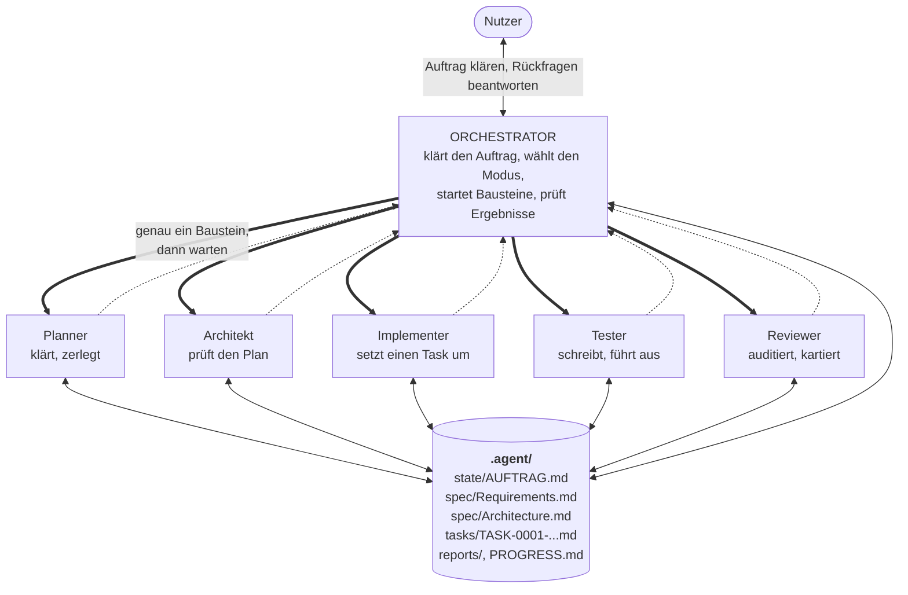
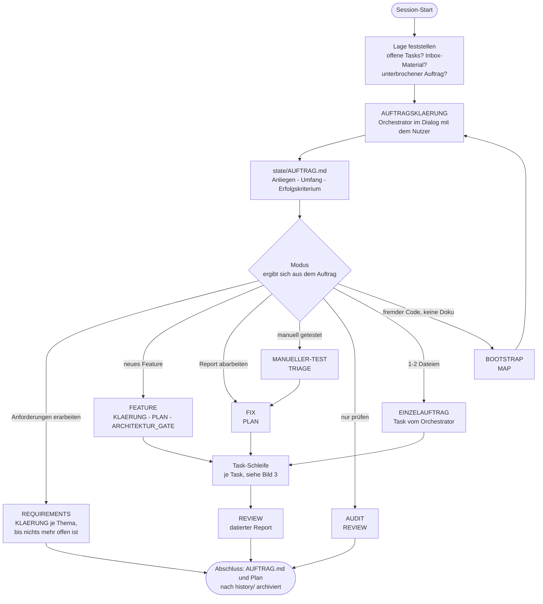
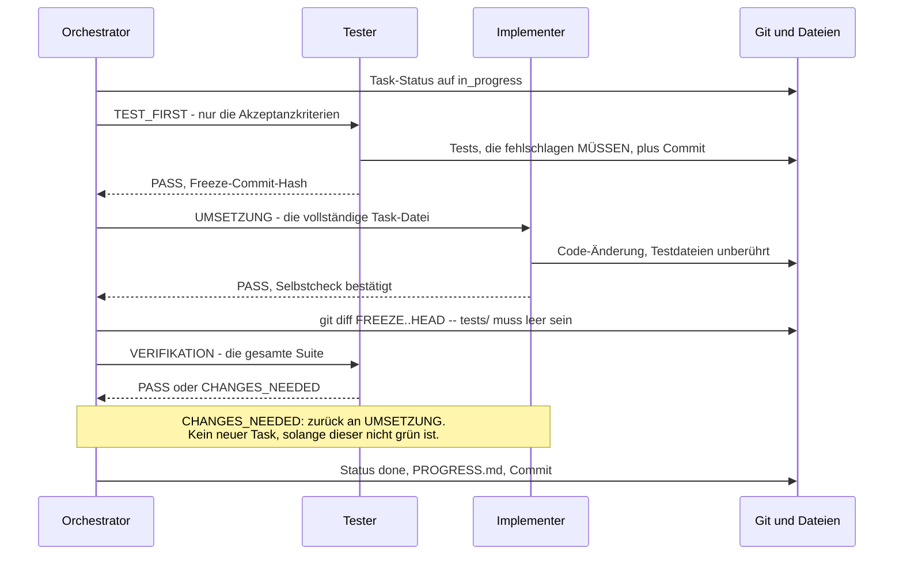

# Agent-Workflow: Rollen-Agenten mit zusammengesetzten Bausteinen

Eine Methode, um ein Software-Vorhaben durch mehrere spezialisierte
Agenten selbständig umsetzen zu lassen, ohne dass Qualität oder
Kontrollierbarkeit leiden – auch (und gerade) wenn einzelne Rollen auf
günstigen oder lokalen Modellen mit begrenztem Kontextfenster laufen.

**Diese Datei erklärt, wie der Workflow funktioniert.** Daneben:

| Datei | Beantwortet |
|---|---|
| `USERMANUAL.md` | Wie richte ich das ein und bediene es? |
| `HARNESS.md` | Welcher Harness kann was, wie laufen Rollen auf anderen Modellen? |
| `DECISIONS.md` | Warum ist es so – und was ist schon schiefgegangen? |
| `project-template/.agent/agents/*.md` | Was eine Rolle **tatsächlich** tut (normativ) |

> Die Rollen-Dateien sind die Quelle der Wahrheit: sie sind der Text, den
> der Agent liest. Dieses Dokument erklärt den Zusammenhang und darf
> deshalb keine Regel in abweichendem Wortlaut wiederholen – im Zweifel
> gilt die Rollen-Datei.

## Das Prinzip in vier Sätzen

1. **Eine Rolle, ein Auftrag, ein frischer Kontext.** Jeder Schritt geht an
   einen neu gestarteten Agenten, der nur seine Auftragsdatei kennt – nie
   die Gesprächshistorie.
2. **Dateien sind das Protokoll.** Rollen reden nie miteinander; sie
   schreiben und lesen Dateien unter `.agent/`. Dadurch überlebt der
   Zustand jeden Abbruch, jeden Modellwechsel und jeden Harness.
3. **Der Orchestrator vermittelt, urteilt aber nicht selbst.** Er klärt den
   Auftrag mit dem Nutzer, wählt die Bausteine, prüft Ergebnisse an Git und
   Dateien – und schreibt selbst keinen Code.
4. **Es gibt keine feste Pipeline.** Aus dem geklärten Auftrag ergibt sich
   ein Modus, und ein Modus ist nur eine Reihenfolge von Bausteinen.

---

## Überblick in drei Bildern

### Bild 1 – Wer redet mit wem (und wer nicht)



Dicke Pfeile: der Orchestrator startet eine Rolle. Gestrichelt: ihr
Verdict kommt zurück. Dünn: Lesen und Schreiben von Dateien.

Die Pfeile **zwischen** den Rollen fehlen nicht aus Platzgründen: es gibt
sie nicht. Implementer und Tester erfahren nichts voneinander ausser dem,
was in der Task-Datei steht. Genau das macht den Tester unabhängig – er
prüft gegen die Akzeptanzkriterien statt gegen die Absicht des
Implementers.

### Bild 2 – Eine Initiative von vorn bis hinten



Zwei Dinge, die das Bild zeigt und die leicht übersehen werden: die
Auftragsklärung steht **vor** der Modus-Wahl (nicht umgekehrt), und
`REQUIREMENTS` endet ohne eine Zeile Code – die Umsetzung ist ein eigener,
neu zu klärender Auftrag.

### Bild 3 – Die Task-Schleife mit Test-Freeze



Der Tester kennt beim Schreiben der Tests **nur** die Akzeptanzkriterien,
nicht die spätere Implementierung – und der Implementer darf die Tests
danach nicht mehr anfassen. Das ist strikt stärker als "unabhängiger
Tester im Anschluss": wer den fertigen Code vor sich hat, prüft unbewusst
gegen die Implementierung statt gegen die Spezifikation.

---

## Wann anwenden

- Das Vorhaben lässt sich in klar abgrenzbare, unabhängig testbare
  Arbeitspakete zerlegen (z.B. Module/Funktionen mit klarem
  Ein-/Ausgabeverhalten).
- Es sollen kleine/günstige (ggf. lokale) Modelle verwendet werden
  (begrenztes Kontextfenster, geringere Zuverlässigkeit bei grossen
  Aufgaben am Stück).
- Gilt sowohl für **Greenfield** (neues Projekt, Requirements + Plan werden
  von Null erarbeitet) als auch für **Brownfield** (bestehender Code ohne
  – oder mit veralteter – Doku; Einstieg dafür: `USERMANUAL.md`, Teil 3).

---

## Teil A – Die Rollen

Jede Rolle hat einen bewusst engen, für sich lauffähigen Kontext und eine
eigene Datei unter `.agent/agents/`. Eine Rolle liest **nie** die volle
bisherige Gesprächshistorie – nur das, was ihre Auftragsdatei (ein Task,
ein Report, o.ä.) tatsächlich braucht.

1. **Orchestrator** (`orchestrator.md`) – dünne Schleife, kein grosses
   Kontextfenster nötig. Ermittelt die Ausgangslage, **klärt den Auftrag
   mit dem Nutzer** (Baustein `AUFTRAGSKLAERUNG` → `state/AUFTRAG.md`),
   leitet daraus den **Modus** ab (Teil C), ruft die Bausteine in der
   dafür festgelegten Reihenfolge auf, wertet deren **Verdict** aus,
   pflegt Task-Status und `state/PROGRESS.md`, committet. Schreibt selbst
   keinen Code und plant selbst keine Schritte. Er ist die **einzige**
   Rolle mit Nutzerkontakt.
2. **Planner** (`planner.md`) – die "Denkarbeit": schärft eine unklare
   Anforderung (Baustein `KLAERUNG`, rundenbasiert über das
   Klärungsprotokoll in `state/AUFTRAG.md`) und zerlegt eine Quelle (neue
   Anforderung oder Findings aus einem Report) in kleine, unabhängige
   `.agent/tasks/TASK-*.md`-Dateien (Baustein `PLAN`). Braucht mehr
   Kontext/Fähigkeit als die Ausführungsrollen – hier lohnt das stärkste
   verfügbare Modell.
3. **Architekt** (`architect.md`) – Read-only Gutachter, der
   den **Plan** gegen `spec/Architecture.md` prüft, **bevor** Code
   entsteht: passt das Vorhaben in eine bestehende Abstraktion oder
   braucht es wirklich eine neue? Werden Schichtgrenzen verletzt? Kommt
   eine Abhängigkeit dazu, die es schon gibt? Fängt Architektur-Drift
   dann ab, wenn sie noch nichts kostet.
4. **Implementer** (`implementer.md`) – setzt **genau einen** Task um
   (Code + ggf. minimale Doku/Architecture-Update), nichts darüber hinaus.
   Kennt weder vorherige noch zukünftige Tasks im Detail.
5. **Tester** (`tester.md`) – unabhängig vom Implementer, kennt nur die
   **Akzeptanzkriterien** des Tasks (nicht die Implementierungs-
   Begründung). Läuft in zwei Bausteinen: `TEST_FIRST` (schreibt die Tests,
   bevor implementiert wird) und `VERIFIKATION` (führt die gesamte Suite
   aus, nachdem implementiert wurde). Diese Unabhängigkeit ist bewusst:
   sie verhindert, dass Tests nachvollziehen, was sich der Implementer
   gedacht hat, statt echt gegen die Spezifikation zu prüfen.
6. **Reviewer** (`reviewer.md`) – read-only Auditor, editiert nie
   Produktcode/Tests. Drei Modi: **Map** (Bestandsaufnahme eines
   bestehenden Codebestands → `spec/Architecture.md`), **Audit** (Code +
   Tests gegen `spec/` prüfen → datierter Report) und **Triage**
   (Rohmaterial aus manuellem Testen in `.agent/inbox/` → Report).
   Erzeugt selbst keine Tasks – das macht der Planner aus dem Report.

Implementer und Tester interagieren **nie direkt** miteinander – jede
Übergabe läuft über den Orchestrator bzw. über die Task-Datei selbst.
Dasselbe gilt für Architekt und Implementer.

### Rollen-Vertrag: einheitlicher Aufbau jeder Rollen-Datei

Jede Datei unter `.agent/agents/` folgt derselben Gliederung. Der Wert
liegt nicht in der Ästhetik, sondern darin, dass eine Rolle beim Lesen
sofort weiss, welcher Abschnitt sie bindet – besonders bei schwächeren
Modellen, die lange Fliesstexte ungleichmässig gewichten.

```markdown
# Rolle: <Name>

<Ein Satz: wer du bist, was dein Ergebnis ist, und was du NICHT tust.>

## Was du liest
<Abschliessende Liste. Alles andere ist ausserhalb deines Auftrags.>

## Vorgehen
<Nummeriert, jeder Punkt eine Handlung – keine Absichtserklärungen.>

## Harte Regeln
<Was du unter keinen Umständen tust. Wo möglich mit konkretem
Anti-Beispiel aus einem realen Vorfall statt abstrakter Regel.>

## Rückmeldung
<Exaktes Ausgabeformat: Verdict-Zeile zuerst, dann die Pflichtangaben.>
```

Der Body enthält **kein** Frontmatter – er ist harness-neutral
(siehe `HARNESS.md`). Die harness-spezifischen Felder liegen daneben in
`<rolle>.meta.yml`.

### Verdicts: das gemeinsame Rückgabe-Vokabular

Jeder Baustein endet mit **genau einer** Verdict-Zeile als erster Zeile
der Rückmeldung. Der Orchestrator verzweigt danach mechanisch (greppbar),
statt Fliesstext zu interpretieren.

| Verdict | Bedeutung | Was der Orchestrator tut |
|---|---|---|
| `PASS` | Auftrag erfüllt, nichts anzumerken | Nächster Baustein des Modus |
| `PASS_WITH_NOTES` | Erfüllt, aber mit Hinweisen für nachfolgende Rollen | Weiter; Notizen in die Task-Datei bzw. den Plan übernehmen |
| `CHANGES_NEEDED` | Nicht erfüllt; die Begründung benennt konkret was fehlt | Zurück an die vorgelagerte Rolle, mit der Begründung als zusätzlichem Kontext |
| `BLOCKED` | Kann nicht entscheiden – Information fehlt oder es ist eine Produktentscheidung | Stopp; Rückfrage an den Nutzer, kein Weitermachen auf Verdacht |

Pflicht in jeder Rückmeldung, unabhängig vom Verdict: geänderte Dateien,
und jede bewusst getroffene Annahme oder Abweichung vom Auftrag (mit
Begründung). `CHANGES_NEEDED` und `BLOCKED` ohne konkrete, überprüfbare
Begründung sind selbst ein Fehler und gehen an dieselbe Rolle zurück.

---

## Teil B – Der Baustein-Katalog

Ein **Baustein** ist ein Aufruf genau einer Rolle mit genau einem Auftrag.
Bausteine sind unabhängig voneinander definiert; ein Modus (Teil C) ist
nur eine Reihenfolge daraus. Es gibt bewusst **keine feste Pipeline**:
nicht jede Arbeit ist "Anforderung bis Auslieferung", und Bausteine, die
nichts zu tun hätten, werden gar nicht erst gestartet.

| Baustein | Rolle | Aktivierung | Input | Ergebnis |
|---|---|---|---|---|
| `AUFTRAGSKLAERUNG` | Orchestrator | **immer**, als erster Baustein jeder Initiative | Nutzer-Anliegen, Lage im Repo | `state/AUFTRAG.md` + der daraus abgeleitete Modus |
| `MAP` | Reviewer (Map) | `spec/Architecture.md` fehlt/leer, aber Code existiert | vorhandener Code | `spec/Architecture.md` |
| `KLAERUNG` | Planner (Klärung) | Anforderung unklar oder `spec/Requirements.md` lückenhaft | `state/AUFTRAG.md`, `spec/` | Fragerunde im Klärungsprotokoll **oder** ausformulierte Anforderung in `Requirements.md` |
| `PLAN` | Planner | immer, ausser bei Einzelauftrag | Anforderung oder Report | `tasks/TASK-*.md` (+ ggf. `state/IMPLEMENTATION_PLAN.md`) |
| `ARCHITEKTUR_GATE` | Architekt | Plan führt neue Komponente/Schnittstelle/Abhängigkeit ein | Task-Set, `spec/Architecture.md` | Verdict + Vorgaben für Implementer |
| `TEST_FIRST` | Tester | pro Task, sofern nicht abgewählt | nur Akzeptanzkriterien des Tasks | fehlschlagende Tests + Commit (Freeze-Grenze) |
| `UMSETZUNG` | Implementer | pro Task | vollständige Task-Datei | Code-Änderung |
| `VERIFIKATION` | Tester | pro Task, nach `UMSETZUNG` | Akzeptanzkriterien + Testlauf | Verdict + Test-Notizen in der Task-Datei |
| `REVIEW` | Reviewer (Audit) | nach Abschluss einer Initiative, oder auf Wunsch | `spec/`, Code, Testlauf | `reports/<datum>-review.md` |
| `TRIAGE` | Reviewer (Triage) | `.agent/inbox/` enthält Material | Inbox-Rohmaterial + Code | `reports/<datum>-triage.md` |

### Auftragsklärung: der einzige Baustein mit Nutzerkontakt

Alle Rollen ausser dem Orchestrator sind Subagenten: einmal gestartet,
eine Rückmeldung, danach weg – sie können den Nutzer weder fragen noch auf
eine Antwort warten. Deshalb liegt das Klären des Auftrags beim
Orchestrator, und sein Ergebnis ist eine **Datei** (`state/AUFTRAG.md`)
statt eines Gesprächsverlaufs:

- Der Modus wird aus dem geklärten Auftrag abgeleitet, nicht aus dem
  Dateizustand plus einer Chat-Antwort. "Requirements sind leer" heisst
  eben nicht automatisch "bau ein Feature".
- Nachfolgende Rollen lesen den Auftrag, statt ihn als Prosa gereicht zu
  bekommen – konsistent mit "eine Rolle liest nie die Gesprächshistorie".
- Eine unterbrochene Session (Rate-Limit, Absturz, anderer Rechner) kann
  den Auftrag wieder aufnehmen, weil er auf der Platte steht.

Der Baustein ist ein **Filter, kein Interview**: gefragt wird nur, wenn
der Modus nicht eindeutig ableitbar ist, ein prüfbares Erfolgskriterium
fehlt, der Umfang offen ist oder der Auftrag etwas Bestehendem
widerspricht – dann höchstens fünf Fragen, jede mit Default-Vorschlag.
Fachlich entworfen wird hier nicht; das ist Sache von `KLAERUNG`.

Die beiden Klärungen sind bewusst getrennt:

| Baustein | Rolle | Klärt | Ergebnis |
|---|---|---|---|
| `AUFTRAGSKLAERUNG` | Orchestrator (im Dialog) | *Was für Arbeit, welcher Umfang?* | `state/AUFTRAG.md` + Modus |
| `KLAERUNG` | Planner (Subagent, je Runde ein Aufruf) | *Ist diese Anforderung planbar?* | Fragen bzw. Anforderung in `spec/Requirements.md` |

### Aktivierung: mechanisch, wo es geht

Ein Baustein wird nicht nach Gefühl gestartet, sondern nach einer
überprüfbaren Bedingung. Wo eine Bedingung mechanisch prüfbar ist, prüft
der Orchestrator sie per Kommando statt sie einzuschätzen:

```bash
# Liegt Rohmaterial zum Triagieren vor?
ls -A .agent/inbox/ | grep -v -e '^processed$' -e '^\.gitkeep$'

# Wurde eine Abhängigkeits-Manifestdatei angefasst?  → ARCHITEKTUR_GATE
git diff --name-only -- pyproject.toml requirements.txt package.json go.mod

# Welche Prüf-Linsen braucht der Review überhaupt?
git diff --name-only origin/main...HEAD
```

**Kein Baustein wird gestartet, dessen Ergebnis absehbar "nichts zu tun"
wäre.** Ein übersprungener Baustein wird aber in `state/PROGRESS.md`
protokolliert – mit der Bedingung, die zum Überspringen führte, damit
später nachvollziehbar ist, dass er nicht vergessen wurde:

```
SKIPPED ARCHITEKTUR_GATE – keine neue Komponente/Abhängigkeit im Plan
(mechanisch geprüft: kein Manifest im Diff)
```

### Prüf-Linsen statt Spezial-Reviewer

Statt eigener Agenten für Sicherheit, Abhängigkeiten, UI usw. bekommt der
eine Reviewer **Linsen**, die der Orchestrator anhand des Diffs aktiviert
(z.B. Sicherheits-Linse bei Krypto-/Auth-/Eingabe-Validierungs-Code,
Abhängigkeits-Linse bei geänderten Manifesten). Das hält die Zahl der
Rollen-Dateien klein und die Aktivierungsentscheidung mechanisch.

---

## Teil C – Modi: Bausteine zusammensetzen

Der Orchestrator ermittelt zu Beginn jeder Session die Ausgangslage, klärt
den Auftrag und leitet daraus den Modus ab. Ein Modus ist nichts weiter
als eine Reihenfolge von Bausteinen.

Jede Initiative beginnt mit `AUFTRAGSKLAERUNG`; der Modus ist das Ergebnis
dieses Bausteins und steht in `state/AUFTRAG.md`. Ein Auftrag ergibt genau
einen Modus – fällt unterwegs etwas an, das einen anderen bräuchte, wird
das ein eigener Auftrag, kein Anhängsel.

```
BOOTSTRAP (Brownfield, erstmalig)
  MAP → danach neue AUFTRAGSKLAERUNG (meist REQUIREMENTS oder AUDIT)

REQUIREMENTS (Anforderungen erarbeiten – Deliverable ist spec/Requirements.md)
  je Thema: KLAERUNG(a: Fragerunde) → Nutzer antwortet (Orchestrator)
          → KLAERUNG(b: Ausformulierung)
  bis der Planner "keine offenen Themen" meldet
  (kein PLAN, keine Tasks, kein Code – die Umsetzung ist ein neuer Auftrag)

FEATURE (neue Anforderung umsetzen)
  KLAERUNG → PLAN → ARCHITEKTUR_GATE
           → [ TEST_FIRST → UMSETZUNG → VERIFIKATION ] pro Task
           → REVIEW

FIX (Findings aus einem Report beheben)
  PLAN → [ TEST_FIRST → UMSETZUNG → VERIFIKATION ] pro Task
       → REVIEW
  (kein KLAERUNG, kein Plan-Dokument – der Report ist die Quelle)

AUDIT (Zustand prüfen, nichts ändern)
  REVIEW

MANUELLER-TEST (Nutzer hat getestet, Material liegt in der Inbox)
  TRIAGE → danach FIX

EINZELAUFTRAG (kleine, klar umrissene Änderung)
  UMSETZUNG → VERIFIKATION
  (kein Planner; der Orchestrator legt die Task-Datei selbst an.
   Zulässig nur, wenn der Auftrag 1–2 Dateien betrifft und prüfbare
   Akzeptanzkriterien hat – sonst ist es ein FIX oder FEATURE.)
```

### Die Klärungsschleife des Modus `REQUIREMENTS`

Der Planner kann den Nutzer nicht fragen und erinnert sich zwischen zwei
Aufrufen an nichts. Trotzdem ist ein mehrrundiges, thematisch geordnetes
Erarbeiten von Anforderungen möglich – weil der Orchestrator das Gespräch
führt und der **Zustand in der Datei liegt**, nicht im Kontext eines
Agenten:

1. `KLAERUNG` (a): Planner wählt **ein** Thema und schreibt höchstens
   sieben Fragen – je mit Begründung und Default-Vorschlag – als neue
   Runde ins Klärungsprotokoll von `state/AUFTRAG.md`.
2. Der Orchestrator stellt sie dem Nutzer wörtlich und trägt die Antworten
   in dieselbe Runde ein.
3. `KLAERUNG` (b): ein **frischer** Planner liest das Protokoll,
   formuliert das Thema in `spec/Requirements.md` aus und meldet als
   letzte Zeile `nächstes Thema: <…>` oder `keine offenen Themen`.
4. Der Orchestrator verzweigt daran: weitere Runde oder fertig. Nach fünf
   Runden ohne Abschluss stoppt er und fragt den Nutzer – eine Klärung,
   die nicht konvergiert, ist ein zu gross geschnittener Auftrag.

Dasselbe Muster trägt überall dort, wo ein kontextfreier Subagent etwas
"Interaktives" beitragen soll: nicht die Rolle interaktiv machen, sondern
den Zustand aus dem Agenten in eine Datei verlagern und den Orchestrator
die Runden takten lassen.

### Nicht verhandelbare Grundregel: strikt sequentiell, nie parallel

Unabhängig vom Modus gilt: Zu jedem Zeitpunkt ist genau **ein** Baustein
aktiv und genau **ein** Task "in Arbeit". Der nächste Task wird nicht
einmal geplant, solange der aktuelle nicht verifiziert und auf `done`
gesetzt ist. Jeder Baustein geht an einen **frischen Agenten** (echter
Aufruf, nicht "im Kontext weiterdenken"); der Orchestrator wartet auf die
vollständige Rückmeldung, bevor irgendetwas anderes passiert.

Begründung und der reale Vorfall, der zu dieser Regel führte: siehe
`DECISIONS.md`, Lehre Nr. 7.

### Start jeder Session

1. **Lage ermitteln** – mechanisch, nicht aus dem Gedächtnis:
   `spec/Architecture.md` (leer, aber Code vorhanden?), `.agent/tasks/*.md`
   nach `status: open`/`in_progress`, `.agent/inbox/` auf Material,
   `state/AUFTRAG.md` auf einen unterbrochenen Lauf.
   - Offene Tasks → dem Nutzer melden (Anzahl, Titel), fragen ob
     fortgesetzt werden soll oder etwas Neues Vorrang hat.
   - Material in der Inbox (auch zusätzlich zu offenen Tasks) → melden,
     fragen ob jetzt triagiert werden soll.
   - Gefülltes `AUFTRAG.md` mit unerledigter Arbeit → dort weitermachen
     statt neu zu klären.
2. **`AUFTRAGSKLAERUNG`** – immer, auch wenn der Nutzer schon gesagt hat,
   was er will. Ergebnis: `state/AUFTRAG.md`.
3. **Modus ableiten** aus `state/AUFTRAG.md`, Bausteine der Reihe nach
   abarbeiten, nach jedem Baustein das Verdict auswerten.
4. **Abschluss**: `state/AUFTRAG.md` (und, falls befüllt,
   `state/IMPLEMENTATION_PLAN.md`) nach `history/` archivieren und auf die
   leere Vorlage zurücksetzen.

### Task-Schleife im Detail

1. Nächsten Task ermitteln: `status: open`, alle Einträge in `depends_on`
   bereits `done`. Bei mehreren wählbaren Tasks: niedrigste ID zuerst.
2. Status auf `in_progress` setzen.
3. `TEST_FIRST` → `UMSETZUNG` → `VERIFIKATION` (Test-Freeze: Teil D).
4. Bei `CHANGES_NEEDED` aus der Verifikation: erneut `UMSETZUNG` für
   denselben Task, mit den fehlgeschlagenen Tests/Fehlermeldungen als
   zusätzlichem Kontext. Zurück zu `VERIFIKATION`. **Kein neuer Task
   beginnt, solange dieser nicht grün ist.**
5. Bei `PASS`: Status auf `done`, Test-Notizen in der Task-Datei, eine
   Zeile an `state/PROGRESS.md`, Git-Commit (Task-ID + Titel).
6. Keine offenen Tasks der Initiative mehr: `state/IMPLEMENTATION_PLAN.md`
   (falls befüllt) nach `history/<datum>-<slug>-plan.md` archivieren und
   zurücksetzen, Zusammenfassung an den Nutzer.

### Delta-fokussierte Wiederholungen

Wird ein Baustein nach einer Korrektur erneut gestartet, bekommt er den
Commit-Hash seines vorherigen Verdicts mit und prüft **nur die Commits
seither** – nicht den gesamten Stand von vorn. Das hält wiederholte
Review-Runden bezahlbar und den Kontext klein genug für kleine Modelle.

---

## Teil D – Mechanische Härtung

Leitsatz: **Eine Prosa-Regel ist die letzte Wahl, nicht die erste.** Wo der
Harness oder ein Kommando dieselbe Zusage erzwingen kann, wird sie so
erzwungen. Bei kleinen/lokalen Modellen ist das kein Feinschliff, sondern
der Unterschied zwischen "hält" und "hält meistens".

| Zusage | Mechanisch durch | Prosa nur als Ergänzung |
|---|---|---|
| Reviewer/Architekt ändern nichts | `tools:`-Allowlist bzw. `permission: { edit: deny }` | "du editierst nie" |
| Implementer fasst keine Tests an | OpenCode `edit: { "tests/**": deny }`; Claude Code `PreToolUse`-Hook; zusätzlich Diff-Prüfung durch den Orchestrator | "du editierst nie Testcode" |
| Frischer Kontext je Baustein | eigener Agenten-/Session-Aufruf | "lies nicht die Historie" |
| Kein Endlos-Lauf | `max_steps` / `steps` / `maxTurns`, `timeout` um den Unterprozess | – |
| Baustein nur wenn nötig | `git diff --name-only`-Bedingung | – |
| Task wirklich erledigt | Diff + Task-Datei prüfen, nicht der Selbstauskunft glauben | Selbst-Check-Liste in der Rollen-Datei |

### Test-Freeze

Die Tests eines Tasks entstehen **vor** seiner Implementierung und werden
danach eingefroren:

1. `TEST_FIRST`: Der Tester schreibt aus den Akzeptanzkriterien Tests, die
   **fehlschlagen müssen** (schlägt keiner fehl, prüft der Test entweder
   nichts oder das Verhalten existiert schon → `CHANGES_NEEDED` bzw.
   `BLOCKED`). Eigener Commit; dessen Hash ist die Freeze-Grenze.
2. `UMSETZUNG`: Der Implementer macht sie grün, ohne Testdateien
   anzufassen.
3. Der Orchestrator prüft das mechanisch:
   ```bash
   git diff <freeze-commit>..HEAD --name-only -- tests/
   ```
   Gibt das etwas aus, werden diese Änderungen verworfen und der
   Implementer bekommt den Verstoss als Kontext zurück.
4. `VERIFIKATION`: Der Tester führt die **gesamte** Suite aus – ein Task ist
   erst grün, wenn nichts anderes kaputtgegangen ist.

Das ist strikt stärker als "unabhängiger Tester im Anschluss": ein Tester,
der den fertigen Code vor sich hat, kann unbewusst gegen die
Implementierung statt gegen die Spezifikation prüfen.

**Ausnahme**, in der Task-Datei explizit zu markieren (`test_first: false`
plus Begründung): Tasks ohne prüfbares Verhalten – reine Doku-Änderungen,
Umbenennungen ohne Verhaltensänderung, Build-/Konfigurationsarbeit. Wer
die Ausnahme wählt, begründet sie in der Task-Datei; stillschweigend
weggelassen wird sie nie.

---

## Teil E – Dateistruktur (pro Projekt)

```
AGENTS.md                        # Projekt-Root, @-importiert agents/orchestrator.md
CLAUDE.md                        # Projekt-Root, @-importiert AGENTS.md

.agent/
  spec/                          # dauerhaftes Produktwissen (PascalCase –
                                 # relevant unabhängig von diesem Workflow)
    Requirements.md              # funktionale Anforderungen, ändert sich selten
    Architecture.md              # aktuelle Komponenten/Verantwortlichkeiten,
                                 # lebendig gehalten, keine Historie

  state/                         # veränderlicher Workflow-Zustand (SCREAMING_SNAKE)
    AUFTRAG.md                   # NUR das aktuell geklärte Anliegen samt
                                 # Klärungsprotokoll; leer, wenn nichts läuft
    IMPLEMENTATION_PLAN.md       # NUR die aktiv laufende Initiative; leer,
                                 # wenn gerade nichts läuft
    PROGRESS.md                  # Append-only chronologisches Log
    MEMORY.md                    # projektspezifische Notizen über Sessions hinweg

  sync-agents.py                 # Generator: neutrale Quelle → Adapter

  agents/                        # eine Datei pro Rolle (lowercase), harness-neutral
    _tiers.yml                   # model_tier → konkretes Modell, je Harness
    orchestrator.md / orchestrator.meta.yml
    planner.md / planner.meta.yml
    architect.md / architect.meta.yml
    implementer.md / implementer.meta.yml
    tester.md / tester.meta.yml
    reviewer.md / reviewer.meta.yml

  tasks/                         # die atomare, planbare Warteschlange (lowercase)
    TEMPLATE.md
    TASK-0001-<slug>.md

  reports/                       # datierte, read-only Review-Ausgaben
    2026-08-30-review.md

  inbox/                         # unstrukturiertes Rohmaterial aus manuellem Testen
    processed/<datum>/           # nach der Triage hierhin verschoben

  runs/                          # Logs fremder Harness-Läufe (nicht committen)
    TASK-0007-umsetzung.log

  history/                       # Archiv abgeschlossener Aufträge/Pläne
    2026-08-15-initial-build-auftrag.md
    2026-08-15-initial-build-plan.md

.claude/agents/                  # generierte Adapter – nicht von Hand editieren
.opencode/agent/                 # generierte Adapter – nicht von Hand editieren
```

Die Drei-Stufen-Schreibweise ist bewusst: `PascalCase` = kuratiertes
Referenzdokument über die Software selbst, `SCREAMING_SNAKE` = einzelner,
mutierbarer Zustand, `lowercase` = viele gleichartige Instanzen
(Rollen/Tasks/Reports). Wer eine Datei sieht, weiss am Namen, in welche
Kategorie sie gehört.

### Task-Datei-Format (`.agent/tasks/TASK-####-<slug>.md`)

Die Task-Datei ist die einzige Information, die eine ausführende Rolle
zusätzlich zum bestehenden Code braucht – und gleichzeitig das Protokoll
zwischen Runtimes. Sie muss deshalb **vollständig in sich geschlossen**
sein.

```markdown

---

id: TASK-0023
title: <kurzer, imperativer Titel>
status: open            # open | in_progress | done | failed | blocked
source: plan-step       # plan-step | review-finding | triage-finding | auftrag
source_ref: state/IMPLEMENTATION_PLAN.md#schritt-6
depends_on: []          # andere Task-IDs, die vorher done sein müssen
files: [pfad/zur/datei.py]

runtime: subagent       # subagent | opencode   – wer führt aus
model:                  # optional; überschreibt den model_tier der Rolle
test_first: true        # false nur mit Begründung im Kontext-Abschnitt

---

## Deliverable
<konkret: max. 1-2 Dateien/Module>

## Akzeptanzkriterien
- <prüfbare Bedingung 1>
- <prüfbare Bedingung 2>

## Kontext
<nur was nötig ist: exakte Zeilen-/Snippet-Referenzen, der Finding-Text,
Verweis auf den relevanten Architecture.md-Abschnitt – nicht die ganze
Datei, nicht die Konversationshistorie>

## Vorgaben aus dem Architektur-Gate
<vom Architekten befüllt, falls der Baustein lief: welche bestehende
Abstraktion zu nutzen ist, welche Grenzen gelten>

## Test-Notizen
<vom Tester befüllt: welche Tests geschrieben/ausgeführt, Ergebnis,
Freeze-Commit-Hash>
```

### Regeln für die Task-Grösse

- Ein Task betrifft max. 1–2 Dateien/Module. Ist er grösser, wird er vom
  Planner weiter unterteilt statt in einem Rutsch vergeben.
- Ein Task muss ohne Kenntnis anderer Tasks umsetzbar sein – Ausnahme:
  `depends_on` macht eine unvermeidbare Reihenfolge explizit.
- Jeder Task hat konkrete, prüfbare Akzeptanzkriterien (keine vagen
  Beschreibungen wie "funktioniert gut").
- Jeder Task lässt das Repo lauffähig und grün zurück.
- Läuft eine Rolle deutlich länger als erwartet oder meldet, der Task sei
  zu gross: **stoppen und neu schneiden**, nicht denselben Auftrag erneut
  starten und hoffen.
- Abhängigkeiten von externer Hardware/Diensten werden vermieden bzw.
  gemockt; Sonderfälle werden eigene, spätere Tasks.

---

## Weiterführend

- **Rollen auf anderen Modellen oder in einem anderen Harness laufen
  lassen** – die verifizierte Harness-Matrix, der Generator
  (`sync-agents.py`), `meta.yml`/`_tiers.yml` und der Aufruf eines fremden
  Harness als Unterprozess: `HARNESS.md`.
- **Einrichten, Arbeit anstossen, Fehlerbilder**: `USERMANUAL.md`.
- **Warum eine Regel existiert und was sie verhindert**: `DECISIONS.md` –
  dort steht zu jeder harten Regel der Vorfall, aus dem sie entstanden ist.
